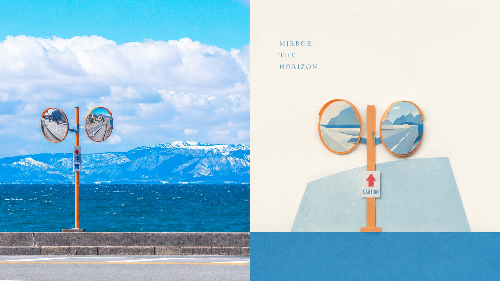
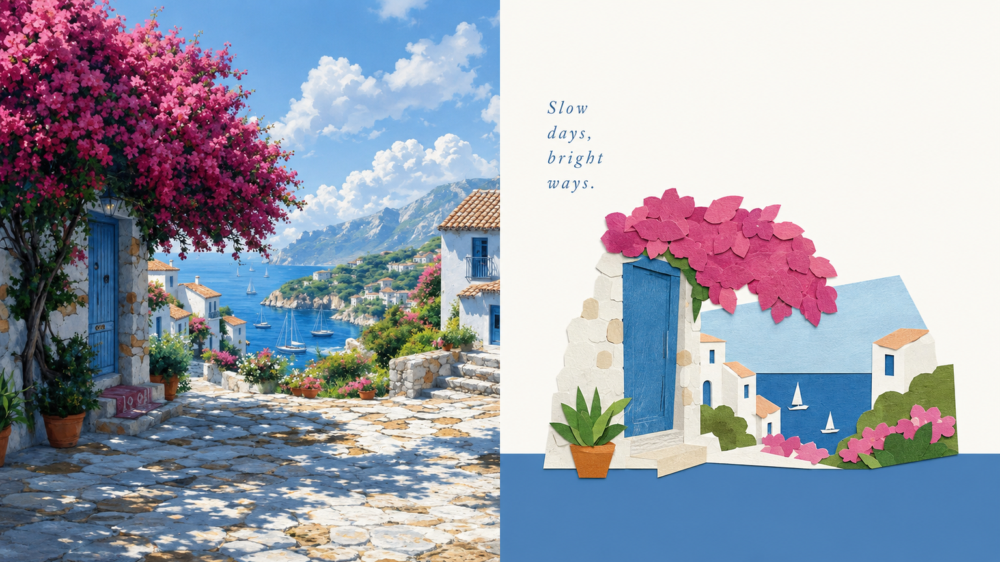
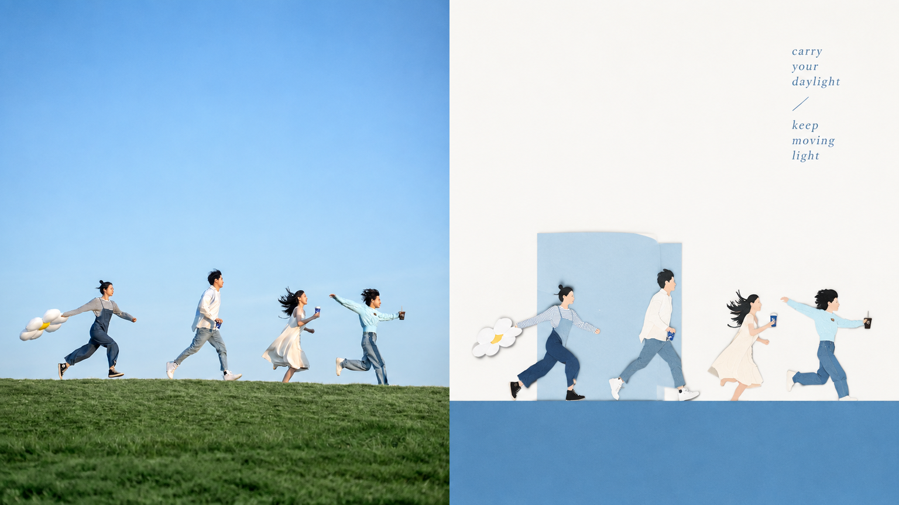
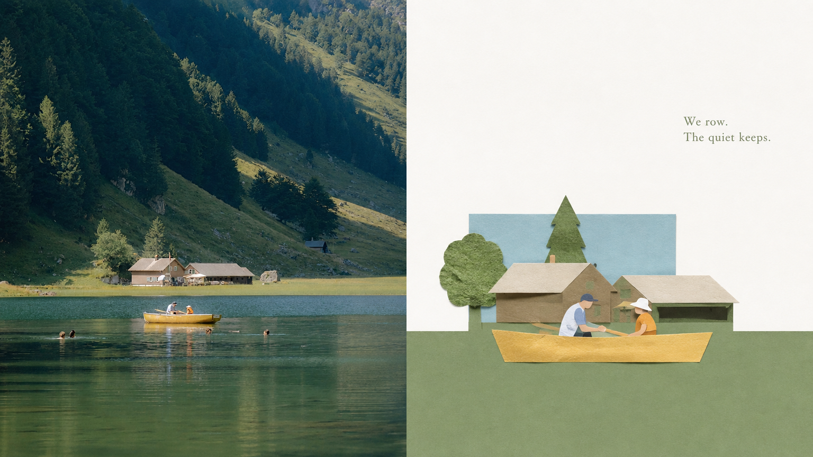
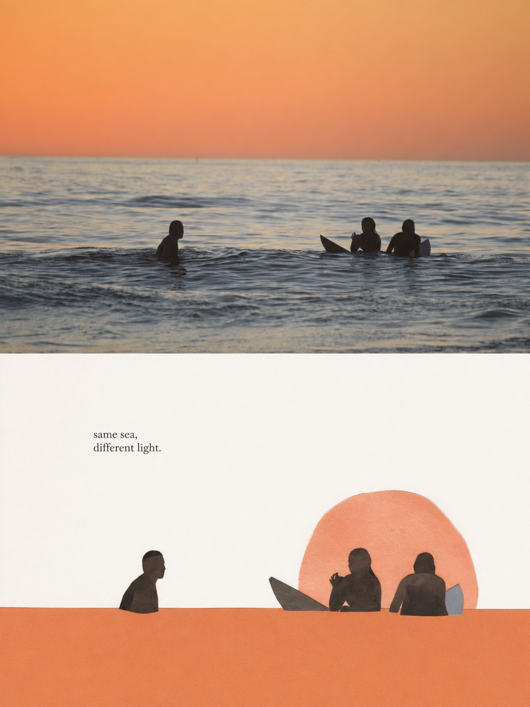
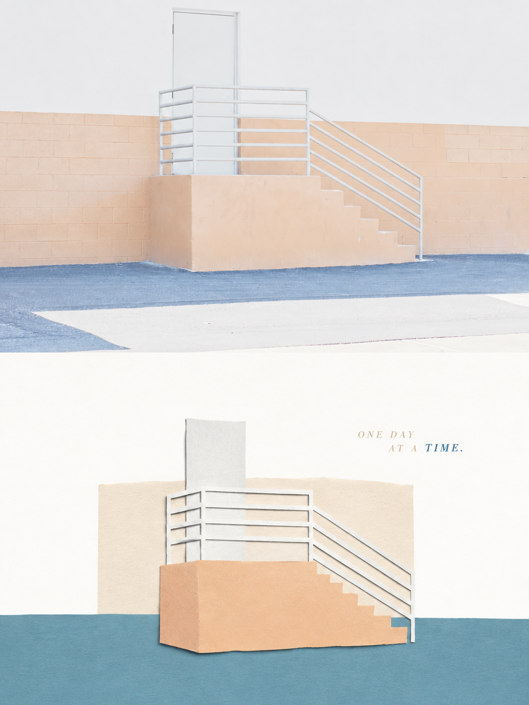
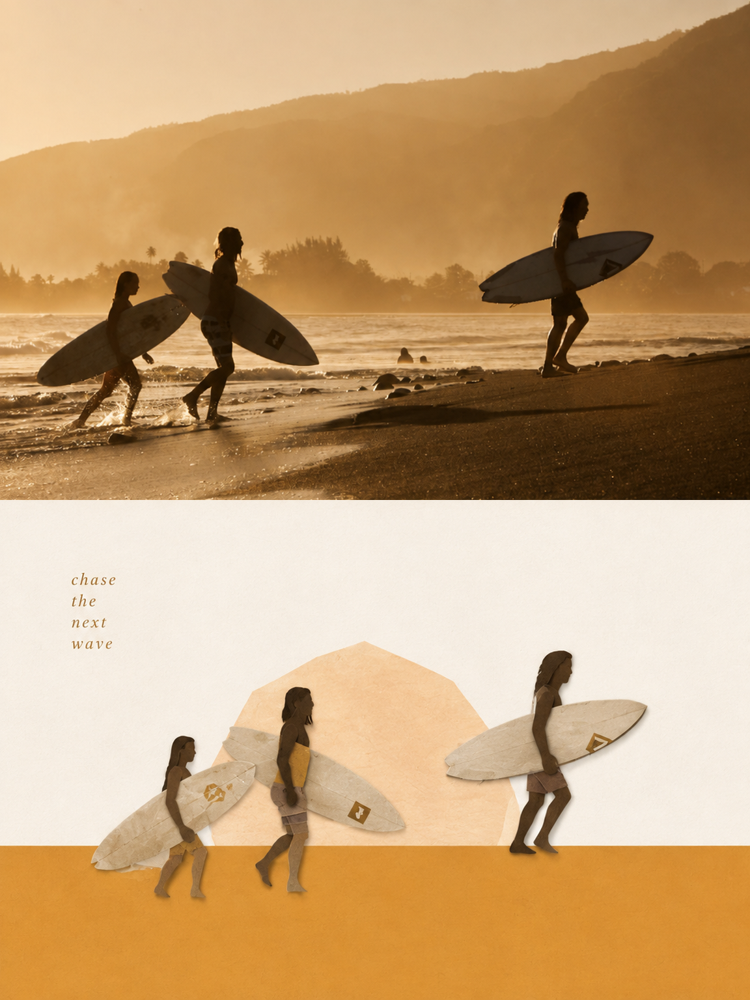
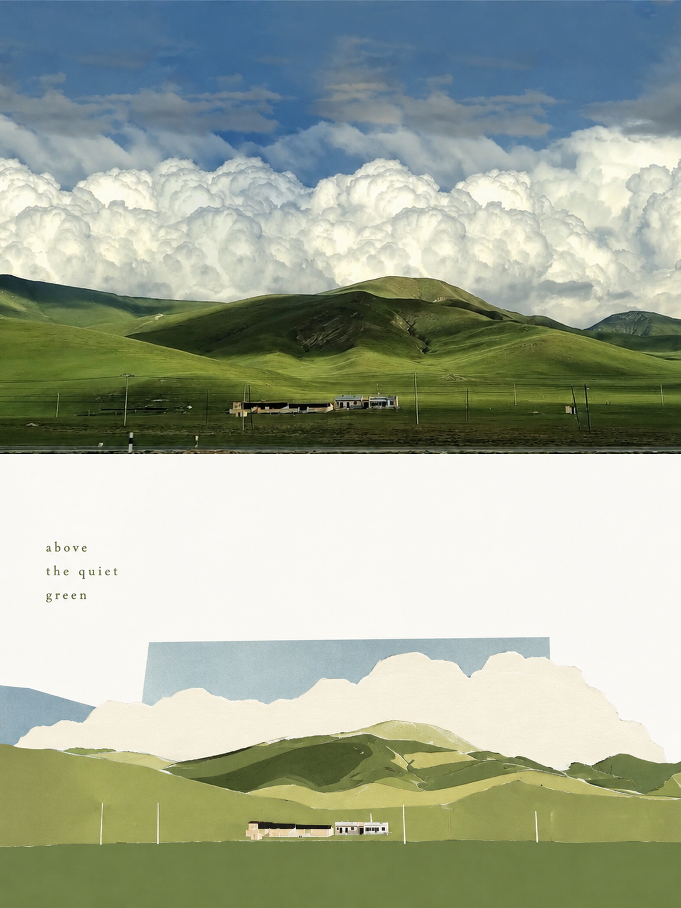

<div align="center">

# XXD Panel 152｜色面ベースのペーパーアート

日常の写真を独立したアートポスターへ。被写体の記憶点を残し、素材・構図・余白を組み直します。

<a href="README.md">简体中文</a> · <a href="README.en.md">English</a> · <a href="README.ja.md">日本語</a> · <a href="README.ko.md">한국어</a> · <a href="README.ar.md">العربية</a>

</div>

## サンプル展示

以下のサンプルはそれぞれ異なる原画像を使い、Panel 152 が一枚ずつ独立した一回の生成で作成しました。AIメタデータは削除済みです。横長は左に実写、右にデザインを置く厳密な50:50、縦長は上に実写、下にデザインを置く厳密な50:50です。

**16:9 横長 · 左右 50:50**

| sample-05 | sample-06 |
|---|---|
|  |  |
|  |  |

**3:4 縦長 · 上下 50:50**

| sample-09 | sample-10 |
|---|---|
|  |  |
|  |  |

サンプルには各原写真に即した、短く工夫された英語のコピーを使っています。

## 向いている場面と解決する課題

個人の写真整理、自主出版、展示の習作、ライフスタイルのビジュアルに。平凡な構図、雑然とした背景、小さな被写体も、削減・再配置・切り抜き・尺度の変更によって焦点を作り直せます。単なる写真フィルターではありません。

下半分では、写真から最も識別しやすい**被写体、輪郭、構造、姿勢、物語的な関係**を抽出し、新たな美術的判断によって、**色面の基座を持つペーパーアート・コラージュのイラスト**へ再構成します。写真全体を複製したり、物を一つずつ描き写したりしないでください。背景や無関係な細部の大半を積極的に取り除き、元の対象を最もよく表す視覚的な記憶の手がかりだけを残します。切り紙の輪郭、紙片の重なり、幾何学的な要約、少量のテクスチャで組み直し、上の写真との対応がひと目で分かるようにします。

## 原文プロンプト · 5言語

[简体中文](references/original-prompt/zh-CN.md) · [English](references/original-prompt/en.md) · [日本語](references/original-prompt/ja.md) · [한국어](references/original-prompt/ko.md) · [العربية](references/original-prompt/ar.md)

中国語ファイルはユーザーの原文を逐字保存し、実行時の創作と美的判断における唯一の基準です。他の4言語は完全で忠実な閲覧用翻訳であり、生成指示を書き換えません。

## クイック判定

元写真の同一性を保ちながら構図を再演出し、素材の特徴と意図的な余白を両立。指定文・自動文案・文字なし、単画像・再帰的フォルダー処理、下記の4出力モードに対応します。

## 写真を作品に変える流れ

被写体と関係を理解 → 原文の視覚言語で抽出 → 無関係な細部を削除 → 尺度・位置・余白を再構成 → 写真に根ざす短い言葉 → 比率・文字・仕上がりを確認

## 完成品の識別ポイント

全体として、**切り紙コラージュ、上下の色面分割、全幅の単色基座、局所的な背景色面、広いネガティブスペース、編集的な組版**が一体となった上質な視覚効果を目指します。場面全体の描き写し、複雑な背景、写実的な遠近法、グラデーション、重い影、画面の埋め尽くし、漫画的表現、3D感、定型的なコラージュを避けてください。

## 4つの出力モード

- `top-bottom`：全幅の上下2領域のみ。実写を上、デザインを下に置き、各50%。
- `left-right`：全高の左右2領域のみ。実写を左、デザインを右に置き、各50%。上下構成へ回転しません。
- `design-only`：全画面を Panel 152 のデザイン翻訳にし、写真は見えない参照にします。
- `wallpaper-pack`：スマートフォン、iPad、デスクトップ、時計を端末ごとに生成。`linked` または `independent` を選べます。

モードと比率は複数指定できます。`1:1`、`3:4`、`4:3`、`4:5`、`5:4`、`2:3`、`3:2`、`9:16`、`16:9`、`21:9`、`5:7`、`7:5`、正確なピクセルに対応します。文字はプロンプト生成、指定文の逐字使用、なしから選べます。フォルダ入力では各画像を分離して処理し、PNGを一つの新しいタスクフォルダへ置きます。

## はじめに

```bash
git clone https://github.com/nevertoday/xxd-panel-152.git
npx skills add https://github.com/nevertoday/xxd-panel-152 --skill xxd-panel-152
```

インストール後に Agent セッションを再起動し、`$xxd-panel-152` を呼び出します。ユーザー単位の Codex には `--global --agent codex --yes` を追加できます。

```text
/xxd-panel-152 photo.jpg --mode top-bottom --size 3:4 --text prompt --locale ja-JP
/xxd-panel-152 photo.jpg --mode left-right --size 16:9 --text prompt --locale en-US
/xxd-panel-152 photo.jpg --mode design-only --size 9:16 --text none
```

完全な実行契約は [SKILL.md](SKILL.md)、実行アダプターは[英語](references/xxd-panel-152-prompt.en.md)／[中国語](references/xxd-panel-152-prompt.zh-CN.md)を参照してください。

## ライセンス

本プロジェクト（Skill、プロンプト、スクリプト、文書、付属サンプル画像を含む）は **PolyForm Noncommercial License 1.0.0** の下で提供されます。完全な法的条文は [LICENSE](LICENSE)、公式ページは <https://polyformproject.org/licenses/noncommercial/1.0.0> を参照してください。

分かりやすく言うと：

- 個人は学習、研究、実験、テスト、趣味のプロジェクト、私的娯楽に使用できます。慈善団体、教育機関、公的研究・安全・保健機関、環境保護団体、政府機関も使用できます。
- **非商業目的**であれば、使用、複製、変更、派生物の作成、共有が可能です。共有時には本ライセンス（または上記リンク）と、作者が示したすべての `Required Notice:` 文を添付する必要があります。
- 商用製品・サービス、有料納品、アクセス権やライセンスの販売、商業利用につながることが予想される用途には使用できません。商用利用には著作権者から別途書面による許可を得てください。
- 本契約が付与するのは明記された著作権ライセンスと限定的な特許ライセンスだけです。商標、ブランド名、その他明記されていない権利は付与されず、ライセンスを第三者へ再許諾することもできません。
- 書面で違反通知を受けた場合、32 日以内に遵守状態へ戻り、実際の是正措置を取らなければライセンスは直ちに終了します。特許侵害を書面で主張した場合も特許ライセンスが終了します。
- 内容は法律が認める範囲で「現状のまま」提供され、保証はありません。利用に伴うリスクと損失は利用者が負います。
